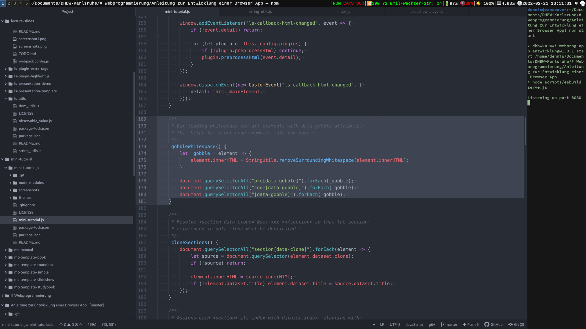

lecture-slides.js utilities
===========================

Short description
-----------------

This is a tiny collection of reusable utility functions and classes
extracted from [lecture-slides.js](https://github.com/DennisSchulmeister/lecture-slides.js)
and [mini-tutorial.js](https://github.com/DennisSchulmeister/mini-tutorial.js)

Screenshot
----------

Ha ha, you were not really expecting a screenshot of a utility library, were
you? Anyway, here you go. 🙃



Module string_utils
-------------------

Utility functions to work with multi-line strings.

```javascript
import StringUtils from "@dschulmeis/ls-utils/string_utils.js";
```

 * `function escapeHTML(html)`: <br/>
    Replace all occurances of `&`, `<`, `>` with `&amp;`, `&lt;`, `&gt;`.

 * `function determineLinebreaks(text)`: <br/>
    Find out which type of linebreak is used in a multi-line string. Returns
    a new string with the found linebreal sequence:

     * "\r\n": Windows style
     * "\n": Unix style
     * "\r": Mac style
     * "": No linebreaks found

 * `function shiftLinesLeft(text)`: <br/>
    Shift all lines of a multi-line text as far left as possible without
    destroying indention. This means, first the minimum amount of leading
    white space of all lines is searched and then removed from all lines.

 * `function removeLeadingLinebreaks(text)`: <br/>
    Remove all empty lines at the beginning of a multi-line text.

 * `function removeTrailingLinebreaks(text)`: <br/>
    Remove all empty lines at the end of a multi-line text.

 * `function trimLines(text)`: <br/>
    Remove trailing white space at the end of each line in a multi-line text.

 * `function removeSurroundingWhitespace(text)`: <br/>
   Removes all leading and trailing empty lines of a multi-line text and
   shifts all lines as far left as possible without destroying indention.
   Useful to gobble empty lines and leading spaces in code examples to
   keep the HTML niceley foramtted.

Module dom_utils
----------------

Browser-side utility functions for DOM manipulation.

```javascript
import DOMUtils from "@dschulmeis/ls-utils/dom_utils.js";
```

 * `function parseHtml(html)`: <br/>
 Trivial replacement for jQuery's parseHtml function. Takes a trusted(!) HTML
 string as input and returns a NodeList of the parsed DOM nodes. Beware, that
 this could potentialy execute JavaScript code in the context of the current
 document, if the HTML code is coming from an untrusted source!

Class ObservableValue
---------------------

```javascript
import ObservableValue from "@dschulmeis/ls-utils/observable_value.js";
```

This is a simple utility class which allows to define a simple kind of
one-way data-binding for variables and object attributes. Whenever the
observable value changes all bound observers will be called. Thanks to
proper setter and getter methods, the value can be used like a plain
variable to set and get its value, but anytime a new value is set all
registered observers will be called:

  * Plain functions, called like func(newValue, oldValue)
  * DOM elements whose innerHTML will be updated (with or without HTML escaping)

Additionaly, validator functions can be attached to check whether a
changed value is allowed. If any validator rejects the change, the old
value will be kept and no observers will be called.

The class has the following methods:

 * `constructor(value)`: <br/>
   Initlialize new observable with an initial value.

 * `get value()`: <br/>
   Get the current value.

 * `set value()`: <br/>
   Attempt to set a new value. First calls all validators to check whether
   the new value is allowed and then calls all bound functions and updates
   all bound DOM elements.

 * `refresh()`: <br/>
   Unconditionaly recall all bound functions and reupdate all bound DOM elemnts.

 * `addValidator(func)`: <br/>
  Add a new validator function to check whether a new value is allowed. The
  function must be of the following form:

  ```javascript
  function validatorFunction(oldValue, newValue) {
      return true;  // Change is allowed, otherwise return false
  }
  ```

 * `removeValidator(func)`: <br/>
  Removes a previously registered validator function. Does nothing if the
  given function is not found.

 * `bindFunction(func)`: <br/>
  Add a new observer function that will be called anytime the value changes.
  The function must be of the following form:

  ```javascript
  function observerFunction(oldValue, newValue) {
      // Do anything you like
  }
  ```

 * `unbindFunction(func)`: <br/>
  Removes a previously registered observer function. Does nothing if the
  given function is not found.

 * `bindElement(element, escape)`: <br/>
  Add a new DOM element whose `innerHTML` will be set to the new value
  anytime the value changes. If `escape` is `true`, reserved HTML characters
  will be escaped to prevent HTML injection. Otherwise the value may contain
  HTML code that will be interpreted by the browser.

 * `unbindElement(element)`: <br/>
  Removes a previously registered DOM element. Does nothing if the given
  element is not found.

Copyright
---------

ls-utils (https://www.github.com/DennisSchulmeister/ls-utils) <br/>
© 2017 – 2022 Dennis Schulmeister-Zimolong <dennis@pingu-mail.de> <br/>
Licensed under the 2-Clause BSD License.
